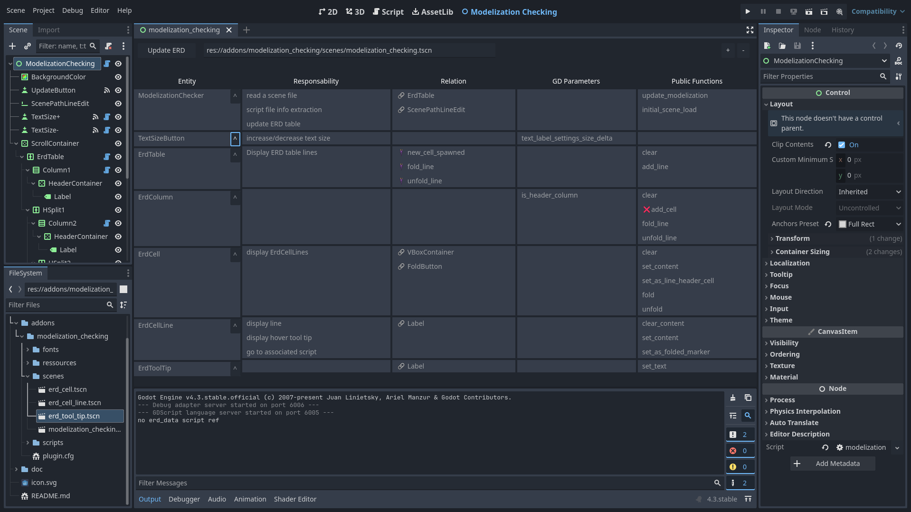

# godot-model-check
A godot addon that offer an entity, responsabiblity, relationship view of your scenes.

# Description
In the creative process of making a game, just after writing a GDD and just before jumping into your game engine, a bit of software modelisation is in order.

My preferd modelisation technique when making a game with Godot is to reference the GDD and go through the following steps:
- List all entities I think are needed in my scene  

Then for each entities:
- List it's responsabilities
- List the relationship needed to fulfill it's responsabilities
- List the game parameters it should expose
- List the public functions other entities will need from it

This modelisation can be organised in a table or node graph, and is very usefull to reference while creating the game. But it is only an initial modelisation, and the realities of programming will reveal flaws in it. In stead of updating this initial modelization each time you make a change to it, this addon gives you a modelisation view of your scenes, allowing you to identify high level modelisation errors that can occur when changing the structure of your game.

For a more indepth exemple on how to use this methodology, see [How to use this addon](doc/how_to_use_this_addon.md).

# Installation

# Features
## Entity information gathering
- On scene change and load, gather for each of the scene's node with a script:
    - [ ] Name in `class_name <name>`
    - [ ] Responsabilities in taged comments `# @respo: <responsability description>`
    - [ ] Relationships:
        - [ ] Signal declaration
        - [ ] Signal subscription
        - [ ] Direct references with `get_node` or `$<node_name>`
        - [ ] (?) Collisions (search for a type check in `on_body_entered`)
        - [ ] (?) Parent and child relationships
    - [ ] Game design parameters in `@export` variables
    - [ ] Public functions (functions not prepended with an underscore)
## Table view

- Customizable display of the scene's entity informations in a table:
    - [ ] Sane default column sizes
    - [ ] Resize columns
    - [ ] Reorder lines
    - [ ] Fold lines
    - [ ] Resize text
    - [ ] Save the customizations made to the table for each scene
- Link information to source:
    - [ ] Hint box showing information source on hover
    - [ ] Click a text to open script at specific line
- Code analysis:
    - [ ] Display a warning when a function has no return type
    - [ ] TODO: find more usefull code analysis feature to include

## Node graph view
- Customizable display of the scene's entity informations in a node graph:
    - [ ] Entities are represented by nodes with their names and their responsabilities
    - [ ] Relationships are represented by links between nodes
    - [ ] Nodes can be reorganised
    - [ ] Nodes background colors can be changed
    - [ ] Remember preferences for each scenes

# Technical documentation
- [model check data structure](doc/data_structure.md)